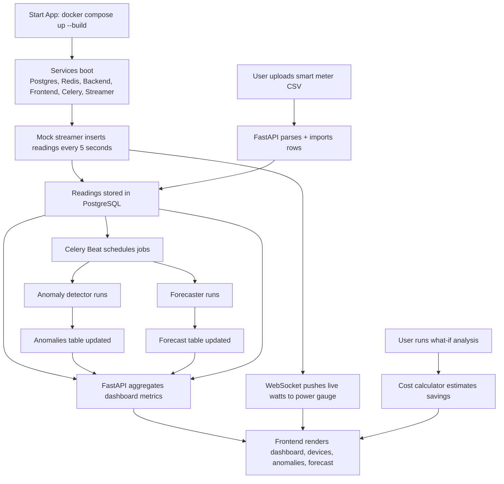

# WattWise

**Your home's energy - finally explained.**

WattWise is a full-stack energy analytics platform that turns raw smart meter data into actionable insights.  
Instead of a single monthly bill, you get:
- when you used power,
- which appliances cost the most,
- where anomalies happened,
- what next month will likely cost,
- and what to change to save money.

---

## Why WattWise?

Most utility dashboards are hard to use and give poor visibility. WattWise solves that by combining:
- a real-time data pipeline,
- a FastAPI analytics backend,
- background anomaly + forecast jobs,
- and a polished React dashboard designed for decision-making.

---

## Core Features

-  Real-time whole-home power gauge (WebSocket updates every 5s)
-  Dashboard KPIs (today usage, monthly cost, anomaly count, predicted bill)
-  Device-level cost breakdown and savings tips
-  Anomaly center with severity filters and acknowledge workflow
-  60-day historical trend + 30-day forecast with confidence band
-  What-if simulator (reduce a device category and estimate savings)
-  CSV upload with interactive column mapping
-  Mock IoT streamer + historical data generation
-  PostgreSQL + Redis + Celery background processing
-  Fully Dockerized local environment

---

## Tech Stack

- **Frontend:** React, Vite, TailwindCSS, Recharts
- **Backend:** FastAPI (Python), Pydantic v2, SQLAlchemy
- **Database:** PostgreSQL
- **Cache/Broker:** Redis
- **Background Jobs:** Celery worker + Celery beat
- **Data Engineering:** mock data generator + live data streamer
- **Infra:** Docker Compose + Nginx

---

## Architecture Diagram (Mermaid)

```mermaid
flowchart LR
    U[User Browser] --> FE[Frontend\nReact + Tailwind + Recharts\nNginx :3000]
    FE -->|REST /api/*| API[FastAPI Backend :8000]
    FE -->|WebSocket /ws/homes/{id}/live| API

    API --> DB[(PostgreSQL)]
    API --> R[(Redis Cache)]
    API --> Q[(Redis Broker/Backend)]

    CW[Celery Worker] --> Q
    CB[Celery Beat Scheduler] --> Q
    Q --> CW
    CW --> DB
    CW --> R

    GEN[Mock Data Generator\nmock_data/generate_energy_data.py] --> DB
    STR[Live Streamer\nmock_data/stream_mock.py] --> DB
    DB --> API

    subgraph Analytics
      AD[anomaly_detector.py]
      FC[forecaster.py]
      CC[cost_calculator.py]
    end

    CW --> AD
    CW --> FC
    CW --> CC
```

---

## Workflow Diagram (Mermaid)



---

## Quick Start (3 minutes)

### 1) Prerequisites

- Docker + Docker Compose installed

### 2) Clone and configure

```bash
git clone <your-repo-url>
cd wattwise
cp .env.example .env
```

### 3) Start everything

```bash
docker compose up --build -d
```

### 4) Open app

- Frontend: http://localhost:3000/dashboard
- API: http://localhost:8000
- API Docs (Swagger): http://localhost:8000/docs
- Health check: http://localhost:8000/health

### 5) Seed realistic demo history (recommended)

```bash
docker compose exec -T mock-streamer python -m mock_data.generate_energy_data --home-id 1 --days 90 --scenario normal --season summer
```

This fills forecast/trend/comparison views immediately.

---

## Running Commands

### Start / stop

```bash
docker compose up --build -d
docker compose down
```

### Tail logs

```bash
docker compose logs -f
```

### Recreate only streamer

```bash
docker compose up -d --force-recreate mock-streamer
```

### Seed alternate scenarios

```bash
# Wasteful home (higher usage + anomalies)
docker compose exec -T mock-streamer python -m mock_data.generate_energy_data --home-id 1 --days 90 --scenario wasteful --season summer

# Eco home
docker compose exec -T mock-streamer python -m mock_data.generate_energy_data --home-id 1 --days 90 --scenario eco --season spring

# Vacation profile
docker compose exec -T mock-streamer python -m mock_data.generate_energy_data --home-id 1 --days 90 --scenario vacation --season autumn
```

---

## API Endpoints

| Method | Endpoint | Purpose |
|---|---|---|
| GET | `/homes/{id}/dashboard` | Full dashboard payload in one call |
| GET | `/homes/{id}/readings?from=&to=&device_id=&granularity=hour\|day\|week` | Aggregated readings |
| GET | `/homes/{id}/anomalies?unacknowledged_only=true&severity=&device_id=` | List anomalies with filters |
| POST | `/homes/{id}/anomalies/{anomaly_id}/acknowledge` | Mark anomaly acknowledged |
| GET | `/homes/{id}/forecast` | Latest 30-day forecast |
| GET | `/homes/{id}/devices/breakdown` | Device-level monthly cost/usage |
| GET | `/homes/{id}/compare` | This month vs last month vs last year |
| POST | `/homes/{id}/upload-csv` | Import smart meter CSV |
| POST | `/homes/{id}/what-if?device_type=&reduction_percent=` | Savings simulation |
| WS | `/ws/homes/{id}/live` | Real-time live readings |

---

## CSV Upload Guide

### Default format

```csv
timestamp,kwh
2026-03-01T08:00:00,1.234
2026-03-01T08:05:00,1.102
2026-03-01T08:10:00,0.956
```

### Flexible format support

Uploader supports column mapping for non-standard exports like:
- `DateTime,Usage(kWh)`
- `Timestamp,consumption`

The UI normalizes mapped columns to `timestamp,kwh` before import.

---

## Mock Data Engine

### Historical generation

`mock_data/generate_energy_data.py` simulates realistic home behavior:
- circadian load pattern (night low, morning/evening peaks),
- seasonal effects,
- appliance-specific behavior (HVAC, EV, fridge, washer/dryer, lighting, vampire loads),
- optional anomaly injection.

### Live stream

`mock_data/stream_mock.py` inserts per-device readings every 5 seconds and logs totals:

```text
Streamed 6 device readings | Home total: 2.4kW
```

---

## How It Works

### 1) Anomaly detection

- Runs on schedule via Celery.
- Detects spikes, vampire drain, flat-lines, and peak-hour overuse.
- Stores findings in `anomalies` for alerting and triage.

### 2) Forecasting

- Uses the last 60 days of readings.
- Combines day-of-week seasonality + trend projection.
- Produces 30-day kWh + cost forecast with confidence interval.

### 3) Cost intelligence

- Uses tariff rates (peak/off-peak/standard).
- Computes device-level costs and savings opportunities.
- Powers "what-if" and "shift usage to save" insights.

---

## Project Structure

```text
wattwise/
  backend/          # FastAPI app, models, schemas, analysis engine, Celery
  frontend/         # React dashboard UI
  mock_data/        # Data generation + live streamer + scenarios
  nginx/            # Frontend reverse proxy config
  docker-compose.yml
  .env.example
```

---

## Environment Variables

See `.env.example` for all variables, including:
- PostgreSQL connection
- Redis URLs
- CORS origins
- Celery broker/backend
- Stream interval/error rate
- Tariff rates

---

## Tech Decisions

- **FastAPI:** high performance, type-safe request/response models, auto docs.
- **PostgreSQL:** strong relational modeling + efficient time-range queries.
- **Redis + Celery:** reliable async processing for analytics jobs.
- **React + Recharts:** expressive interactive visualizations with fast UX iteration.
- **Docker Compose:** one-command local setup for full-stack reproducibility.

---

## What Problem It Solves

WattWise helps homeowners answer practical questions:
- Why was my bill so high this month?
- Which appliance is responsible?
- Is this spike normal or a fault?
- What will my next bill be?
- What simple behavior change saves the most money?

---

## Roadmap

- Zigbee / Z-Wave real device connectors
- Utility provider API integrations
- Multi-home / landlord portfolio support
- Mobile companion app
- Auth + multi-user roles
- LLM-based natural-language energy assistant

---

## Portfolio Positioning

This project demonstrates:
- full-stack engineering,
- real-time systems,
- background job orchestration,
- data modeling + analytics,
- and product-grade dashboard UX in a single deployable stack.

